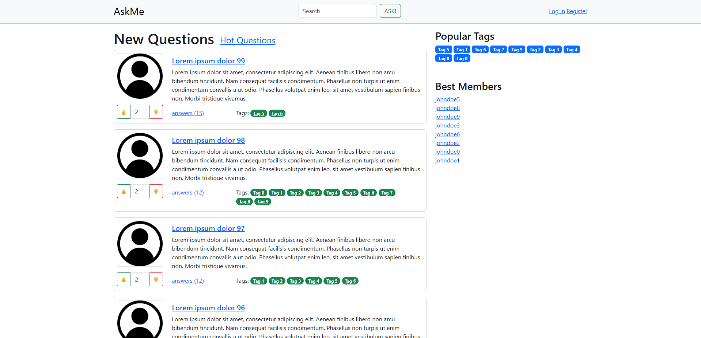
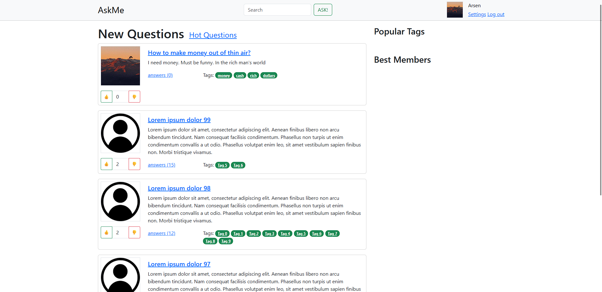
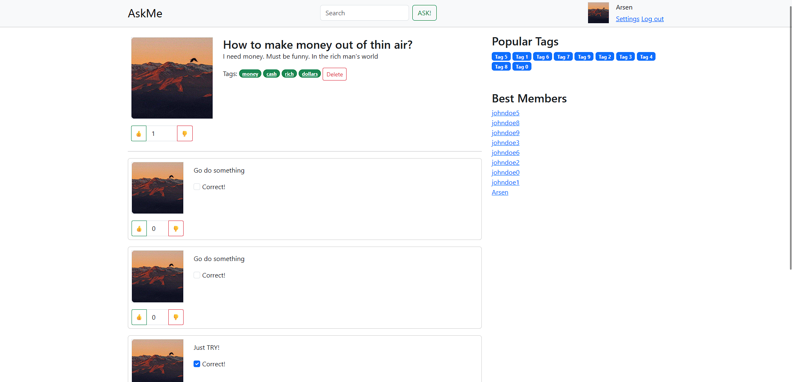
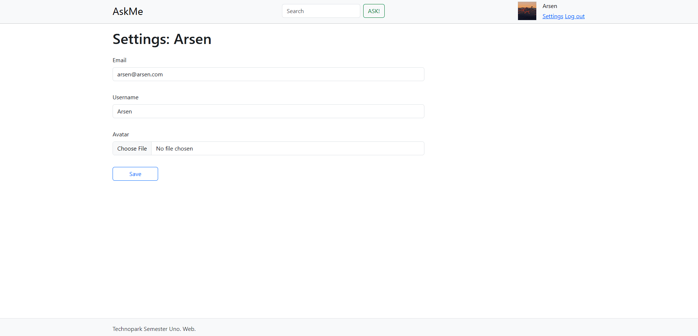
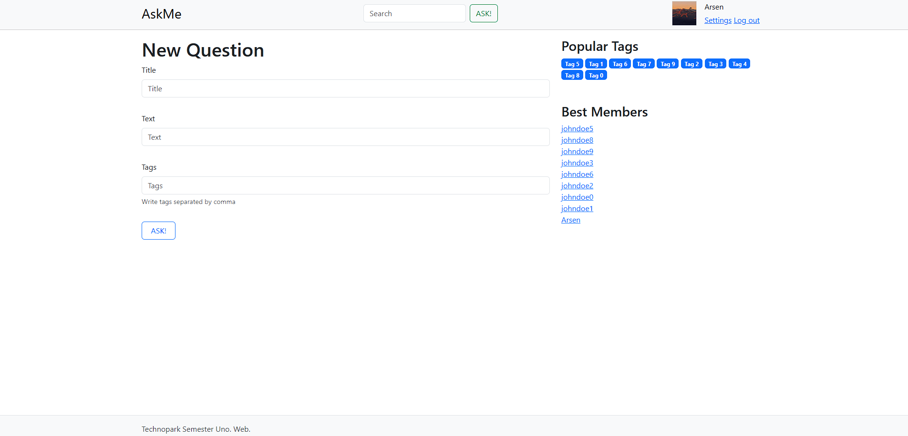

# Task

https://github.com/ziontab/tp-tasks/

# Setup

1. Install all python dependencies `pip install -r requirements.txt`
2. Install nginx and place config files in nginx/ dirs into nginx configs directory
3. Install centrifugo
4. Launch the app (`gunicorn -c gunicorn.conf.py askme_rasulov.wsgi`)

# Screenshots

### Home page

### Home page (logged in)

### Single question

### Settings page

### New question page

